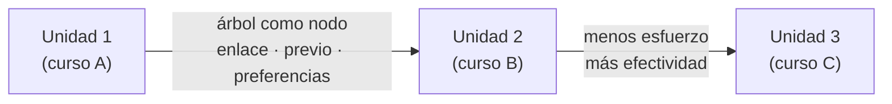
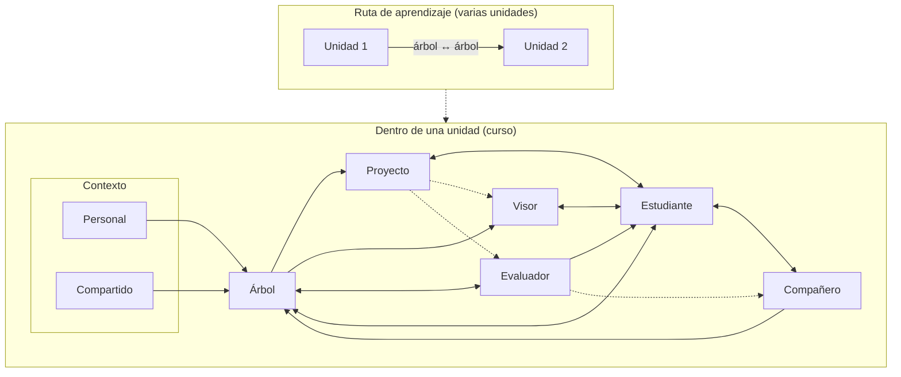

# Mapa del sistema — Proyecto Stitch

> **Documento de discusión con el docente** · se actualiza con cada conversación  
> **Inicio:** 2026-09-01  
> **Estado:** borrador — la foto finish se construye poco a poco

---

## Para qué es este documento

Discusión con el docente sobre la **idea completa** de Stitch: no un cronograma ni un plan por semestres (eso vive en `/cronograma` y en el trabajo semanal), sino una **foto finish** — cómo se vería el **sistema entero** cuando todas las piezas están en su lugar.

El mapa sirve para ver **relaciones**: qué parte es qué, cómo se conecta con las demás y qué papel cumple en un estudio autónomo, interactivo y con significado.

Este archivo **crece por partes**: cada conversación puede nombrar un componente nuevo, afilar una relación o corregir algo que ya estaba escrito. No hace falta tenerlo cerrado de una vez.

Cada ronda debería dejar:

1. partes nuevas o revisadas,
2. relaciones aclaradas,
3. lo que quedó pendiente de nombrar.

---

## Qué es el mapa (y qué no es)

| Es | No es |
|----|--------|
| La **foto finish** del sistema completo | Un plan semestre a semestre |
| **Relaciones** entre piezas | El cronograma del laboratorio |
| Un borrador que **se completa con el tiempo** | Un entregable cerrado de una semana |
| Material para **alinear con el docente** la visión global | Sustituto de `/problema`, `/marco` o `/grafo` |

---

## Foto finish (borrador — se afina en conversación)

Visión provisional de cómo se vería todo junto:

> Un entorno donde una persona puede **aprender por su cuenta** con **significado** (vinculado a su propósito e intereses), **interacción** (presencia que sostiene el ritmo, no un menú frío) y **criterio honesto de avance** (poder hacer, no acumular credenciales vacías) — con **Stitch** como compañero (marco en `/marco`) y vivido en laboratorios por dominio (Stitch Code como el primero).

*Esta frase es punto de partida, no versión final.*

---

## Nombres: qué es «Stitch» y qué es el sistema

En el mapa conviven varios usos de la palabra; conviene fijarlos para no mezclar la **entidad** con el **proyecto** ni con el **sistema completo**.

| Término | Qué es |
|---------|--------|
| **Stitch** (propiamente) | El **compañero** — el agente de acompañamiento. Ese es el nombre de la entidad. |
| **Marco del compañero** (`/marco`) | Reglas y criterios de **cómo debe acompañar** Stitch (entendimiento, constancia, ayuda mínima en prueba, etc.). Documentado en `/marco`, `docs/marco/`. **Es el único marco formal que existe hoy.** |
| **Marco del sistema completo** | **No existe** por ahora. La foto finish tiene varias entidades; cada una tendrá sus criterios cuando se diseñen (evaluador, visor, proyecto…). No confundir con `/marco`. |
| **Stitch + árbol** | Núcleo mínimo habitual en conversación: el compañero **con** el árbol de conocimiento. El árbol **no** se llama Stitch. |
| **Sistema completo** | Las **siete entidades** del mapa + **unidad** + **ruta** (foto finish). |
| **Proyecto Stitch** | La **investigación** y el laboratorio web — nombre del proyecto, no sinónimo del compañero. |
| **Stitch Code** | Primera **unidad** del laboratorio; dominio: **ingeniería de software** (programación, paradigmas, estructuras de datos, algoritmos, principios de ingeniería de software). Vehículo experimental de esta línea. |

En el resto del documento: **sistema** = foto finish; **Stitch** = compañero; **marco** (sin calificativo) = marco del compañero en `/marco`, salvo que diga explícitamente «Proyecto Stitch».

---

## Pertinencia de la solución frente a la problemática

Esta sección evalúa **qué tan pertinente** es la **solución del sistema completo** (mapa de entidades; marco del compañero donde aplica) frente a la problemática que la investigación evidencia — en contraste con Coursera, Platzi, Udemy y afines.

**Pertinente** aquí significa: ¿el diseño **atiende de verdad** el quiebre, o solo lo nombra? La respuesta puede ser fuerte en intención y aún **sin validar** en prototipo — se marcan ambas cosas.

### Problemática evidenciada (síntesis)

Plataformas de cursos en línea (Coursera, Platzi, Udemy, modelo similar):

1. **Cierre en certificado sin garantía** — completar el flujo no implica dominio; la credencial dejó de ser señal fiable de la entidad sobre la persona.
2. **IA agrava la brecha** — es posible avanzar o «aprobar» sin **evidenciar desempeño** real en el tema.
3. **Impartición = consumo de contenido** — puede haber calidad, pero poco **acompañamiento** cuando baja la motivación o hace falta interiorizar.
4. **Conocimiento que no se usa** — mucho material enunciable, poca exigencia de **aplicación** y transferencia.
5. **Mercado de cursos y redundancia** — el negocio premia **más catálogo**, no criterio común de aprendizaje verificable; abundancia repetitiva entre ofertas.

*En una frase:* mucho contenido, mismo final vacío — credencial que ya no garantiza poder hacer.

### Cómo leer la tabla de pertinencia

| Nivel | Significado |
|-------|-------------|
| **Alta (diseño)** | El mapa prevé un mecanismo **directo** para esa falla; falta evidencia empírica del prototipo. |
| **Media** | Responde **en parte**, o la efectividad depende de calibración / contexto / uso. |
| **Baja** | La problemática es real, pero **no es el foco** de esta solución o solo se roza. |

### Problemática → respuesta del sistema → pertinencia

| # | Quiebre en el modelo actual | Qué aporta el sistema (mapa) | Pertinencia | Nota honesta |
|---|------------------------------|-------------------------|-------------|--------------|
| 1 | Certificado sin garantía de dominio | **Evaluador**: pruebas de **desempeño**; avance por evidencia, no por credencial. | **Alta** | Eje del problema de investigación. Riesgo: pruebas mal diseñadas = otro certificado con distinto nombre. |
| 2 | IA no evidencia desempeño en el tema | Evaluador + **ayuda mínima** de **Stitch** (compañero) en prueba; iteración si hubo dependencia excesiva. Sin nota: quien **aprende** es el estudiante aunque resuelva con IA. | **Alta–media** | El diseño separa «pasar» de «interiorizar»; falta validar en prototipo. |
| 3 | Contenido sin acompañamiento / abandono | **Stitch** (compañero) + **visor** (narrativa ligada al usuario, no video de catálogo). | **Alta** | Pregunta central: autonomía **con** presencia. |
| 4 | Aprendizaje pasivo (solo mirar cursos) | Tres frentes activos: **(1) Stitch** — reglas del acompañamiento que **abogan por el entendimiento**, no por terminar el video; **(2) Evaluador** — exige actuar con **propio conocimiento**; sin nota, el mensaje es que aunque pueda usar IA para resolver, **el aprendizaje solo le queda al estudiante**; **(3) Proyecto** — **aplicación** de lo aprendido en un reto con sentido. | **Alta** | No depende solo del visor: compañero, evaluador y proyecto **fuerzan** activación. Falta evidencia en uso real. |
| 5 | Conocimiento inerte / sin aplicar a intereses | **Proyecto** (meta ↔ curso, casos de éxito); **árbol** con preferencias; visor asocia conceptos. | **Alta** | Calibrar delimitado vs trivial sigue abierto. |
| 6 | Catálogo caótico / elegir entre mil cursos | **Revisión cuidadosa de contenidos** + **árbol**, **unidad** y **ruta**: se ofrece una **ruta segura** — no hace falta navegar un marketplace infinito. El dominio está curado y el recorrido definido. | **Alta** | Pertinente **dentro del sistema**: no arregla Udemy, pero **sí** garantiza (por diseño) un camino sin fatiga de elección. |
| 7 | Redundancia y mercado de cursos **como industria** | El sistema **no es marketplace**; es **alternativa honesta** con otra perspectiva — criterio de aprendizaje, no más catálogo. | **Baja** | No corrige la industria global; **evita reproducirla** y ofrece otro modelo. Eso es suficiente para el alcance de la investigación. |
| 8 | Poca prueba de interiorización / transferencia | Evaluador (casos nuevos, dificultad calibrada); proyecto en contexto real. | **Alta** | Falta implementar baterías en Stitch Code. |

### Balance: qué tan pertinente es la solución en conjunto

**Donde la solución es más pertinente** — y justifica la investigación:

- Sustituir **certificado vacío** por **evidencia de desempeño** (evaluador, fase posterior).
- **Ruta segura** con contenidos **revisados con cuidado** — sin elegir entre mil cursos (árbol, unidad, ruta).
- Pasar de **consumo pasivo** a **activación triple**: **Stitch** (entendimiento), **evaluador** (propio conocimiento, sin nota), **proyecto** (aplicación).
- Pasar de **contenido enunciable** a **aplicación con sentido**.

**Donde la pertinencia es limitada (y se asume con honestidad):**

- **Mercado global de cursos** — el sistema es **alternativa con otra perspectiva**, no corrección de la industria (pertinencia **baja** a propósito).
- **Docente** y **comunidad** fuera de alcance de esta línea.
- Todo es **pertinencia de diseño** hasta evidencia del prototipo.

### Frase para el docente

> La investigación ataca el cierre **certificado sin garantía** y el **consumo de contenido sin acompañamiento ni desempeño verificable** — típico de Coursera, Platzi, Udemy — proponiendo un sistema donde el avance es **poder hacer** con constancia sostenida. La solución es **pertinente** en ese quiebre concreto; **no pretende** resolver la industria del curso en línea ni la educación presencial en bloque.

*Detalle del problema en* `/problema` *· marco del compañero en* `/marco`.

---

## Jerarquía en el mapa

No todas las entidades pesan igual:

| Rol | Entidad | Qué significa |
|-----|---------|---------------|
| **Lo más importante** | Estudiante | El sistema existe para sostener su agencia y su aprendizaje. |
| **Elemento central** | Árbol de conocimiento | Estructura el dominio, el progreso y las preferencias — es el eje por donde circula casi todo. |
| **Condiciona el eje** | Contexto | Personal (el usuario) o compartido (cohorte); moldea el árbol y anticipa comunidad. |
| **Presenta el recorrido** | Visor | Construye en tiempo real la explicación narrada y ligada al usuario sobre los temas en juego. |
| **Mide el desempeño** | Evaluador | Arma pruebas enfocadas en poder hacer; informa previo, progreso y metas — sin lógica de nota. |
| **Da sentido aplicado** | Proyecto | Vincula metas del estudiante con el curso; propone un reto delimitado y no trivial donde usar lo aprendido. |
| **Acompaña el recorrido** | Compañero (**Stitch**) | Agente de acompañamiento; nombre propio **Stitch** = esta entidad. |

*Central* no es lo mismo que *más importante*: el árbol organiza el sistema; el estudiante es quien le da sentido.

Las **siete entidades** siguientes son el **núcleo que este estudio asume** en la foto finish dentro de una unidad (curso). La investigación **arranca** por **Stitch** (compañero); el resto del mapa es materia de **discusión y desarrollo progresivo** — ver [Desarrollo progresivo](#desarrollo-progresivo). **Docente** y **comunidad** completan la foto finish pero quedan **fuera del alcance** de esta línea — ver [Alcance de este estudio](#alcance-de-este-estudio).

---

## Entidades y responsabilidades

Núcleo **en el mapa** (foto finish): **siete entidades** dentro de una unidad (curso), más escala de **ruta**. **Desarrollo actual:** Stitch + árbol (progresivo); visor, evaluador y proyecto en **fases posteriores**. Docente y comunidad existen en la foto finish pero **fuera de este estudio**.

### Estudiante (polo de agencia)

En el mapa aparece como «entidad» por simetría con las demás piezas, pero **no es un módulo de software**: es el **usuario** en cuyo nombre se mueve el sistema.

**Potestad:** gestionar su propio aprendizaje.

- Decide ritmo, metas y qué profundizar.
- Guía la narrativa del recorrido; el sistema estructura, **no sustituye** esa agencia.
- Solicita ayuda a Stitch cuando la necesita.

**Qué hace el diseño:** no «implementar al estudiante», sino **promover y sostener su agencia** — información para decidir, criterio honesto de avance, acompañamiento cuando la constancia falla. El sistema **orbita** al usuario; el usuario no es un componente más del diagrama.

### Contexto

**Potestad:** condicionar qué se enseña, cómo y con qué matices — antes y alrededor del recorrido.

El término es **ambiguo a propósito**: según el caso, el contexto es casi el mismo estudiante, o un marco compartido por varios. En el mapa conviene tratarlo como **una entidad con dos caras**, no como dos cosas distintas.

#### Contexto personal (≈ el propio estudiante)

Datos y particularidades **propias del usuario** que condicionan cómo vive el aprendizaje:

- origen, idioma, intereses, conocimiento previo, situación vital;
- lo que en el árbol aparece también como **preferencias** — hay solapamiento: parte del contexto personal *es* el estudiante mirado desde fuera del sistema.

Aquí el contexto y el estudiante están muy cerca; la frontera es **quién condiciona qué**: el estudiante **gestiona**; el contexto personal **informa** al árbol y a Stitch sin quitarle agencia.

#### Contexto vs preferencias del árbol (pendiente de investigación)

Hay **solapamiento** entre contexto personal y **preferencias** guardadas en el árbol (intereses, asociaciones, tono). Falta aclarar en investigación:

- qué datos viven en **contexto** vs **árbol**;
- qué se duplica y qué se referencia;
- quién actualiza qué cuando el estudiante cambia de meta o de interés.

No bloquea el mapa; es **pregunta de diseño** a resolver al prototipar.

#### Contexto compartido (cohorte, grupo, institución)

Cuando un **grupo de estudiantes** usa el sistema en un mismo marco — curso, cohorte, programa, región — entran **cosas en común** que no son de una sola persona:

- currículum acordado, calendario, prioridades institucionales o culturales del grupo;
- particularidades locales compartidas (país, idioma de impartición, referentes comunes);
- reglas o convenciones del entorno (qué contenidos, en qué forma, con qué énfasis).

Este contexto compartido **condiciona al árbol** para todos los que comparten ese marco, y **anticipa** ajustes futuros de **interacción en comunidad**: si ya hay un grupo con contexto común, más adelante tiene sentido pensar cómo esos estudiantes se relacionan entre sí, no solo con el compañero.

| Cara | Quién aporta | Qué condiciona | Horizonte |
|------|--------------|----------------|-----------|
| **Personal** | El propio estudiante (datos, historia, preferencias) | Instancia del árbol para *esta* persona; tono del compañero | Aprendizaje autónomo individual |
| **Compartido** | Cohorte, institución, diseño del curso | Misma instancia base del árbol para el grupo; marco común | Comunidad de aprendizaje (por ahora horizonte) |

En ambos casos el contexto **no reemplaza** al estudiante ni al compañero; **moldea** la instancia del dominio en el árbol (contenidos, forma, matices). Lo compartido no implica que la comunidad ya exista como feature — solo que el diseño debe **pensar a futuro** esos ajustes cuando hay grupo.

#### En Stitch Code: los dos casos concretos

Bajo el mismo laboratorio (**Stitch Code**, línea de **ingeniería de software**) viven **ambas caras** del contexto — no son dos productos distintos, sino dos **modos de uso** del mismo sistema:

| Modo | Contexto predominante | Quién | Marco común |
|------|----------------------|-------|-------------|
| **Abierto** | Personal (+ idioma/región) | Usuario **cualquiera** de habla **español** | Dominio: programación; tono y ejemplos en español; sin cohorte fija |
| **Aula** | Compartido (+ personal encima) | **Grupo en clase** bajo aprendizaje de programación | Curso, calendario, objetivos del aula, referentes del grupo; misma base del árbol para la cohorte |

- **Modo abierto:** el contexto es casi el propio estudiante — intereses, ritmo, conocimiento previo — con el único marco compartido de idioma (español) y dominio (código).
- **Modo aula:** el contexto compartido del curso **condiciona el árbol** para todos; cada estudiante aporta además su capa personal. Sirve como **modo de profundización** — mismo sistema, marco institucional más explícito — **no** como sustituto del docente ni como diseño de aula sin figura humana. La cohorte anticipa comunidad (horizonte); el docente sigue **fuera del alcance** de esta línea de investigación.

Mismo núcleo (estudiante, árbol, visor, evaluador, proyecto, compañero); distinta **instancia** del contexto según el modo.

### Árbol de conocimiento

**Potestad:** sostener la verdad del dominio y el estado del aprendiz sobre ella. Es el **elemento central** del sistema — el eje estructural — pero no el más importante (ese lugar es del estudiante).

1. **Conocimiento certero del curso** — qué es el dominio, cómo se relacionan sus piezas (la «verdad» ya **moldeada por el contexto** y sujeta a **revisión cuidadosa de contenidos** — no catálogo abierto).
2. **Grafo de progreso** — qué ya recorrió esta persona, qué falta, cómo avanza en ese conocimiento.
3. **Preferencias del estudiante** — capa de personalización (intereses, asociaciones, tono) que **no altera** el núcleo certero, pero vincula el contenido con lo propio del aprendiz.
4. **Estructura pedagógica para el visor** — ordenar y relacionar el conocimiento de forma **adecuada a este estudiante**, para que el visor construya explicación pertinente y asociación de conceptos.
5. **Nodo en ruta de aprendizaje** — cuando hay **varios cursos concatenados**, el árbol de una unidad actúa como **nodo que enlaza con el siguiente**: transfiere información de dominio ya cubierta, preferencias y patrones aprendidos para **reducir el esfuerzo** de arranque en la unidad siguiente y **aumentar la efectividad** (menos repetición inútil, anclajes más rápidos, pruebas iniciales más finas). No es un árbol aislado por curso si el estudiante sigue una ruta — es parte de una **cadena**.

#### Árbol y grafo: connotación, no dos entidades obligatorias

La duda *árbol vs grafo* es sobre **qué proceso evoca cada término**, no sobre dividir el diseño en dos piezas rivales:

| Término | Connotación (qué proceso sugiere) |
|---------|-----------------------------------|
| **Árbol** | Estructura con raíz, ramas, recorrido — crecimiento, jerarquía, camino del aprendiz. |
| **Grafo** | Red de nodos y relaciones — interdependencia, vecindad, mapa del dominio. |

Una misma entidad puede **hablar en árbol** cuando enfatiza el recorrido y el progreso, y **en grafo** cuando enfatiza las relaciones entre conceptos. Lo que importa en el mapa es la **responsabilidad** (verdad + progreso + preferencias), no pelear por el nombre único. En este documento se usa **árbol de conocimiento** como etiqueta de la entidad central; dentro de ella conviven ambas lógicas.

**Desarrollo progresivo:** el árbol concentra **varias funciones** (verdad, progreso, preferencias, estructura para visor, nodo en ruta). No se implementan todas a la vez: su diseño y su implementación son **progresivos** — primero lo mínimo para que Stitch lea dominio y avance; después capas según fase (ver [Desarrollo progresivo](#desarrollo-progresivo)).

### Compañero (Stitch)

**Nombre propio: Stitch.** Es el **compañero**. Sus criterios de diseño — el **marco del compañero** — están en `/marco` (no hay marco del sistema completo). En el mapa del sistema completo la entidad se llama **compañero**; **Stitch** es solo el compañero. En conversación: «Stitch + árbol» como núcleo mínimo; el árbol es entidad aparte.

**Potestad:** acompañar en el proceso — no decidir por el estudiante.

1. **Retroalimentación y explicaciones** — cuando el estudiante las solicita; amplía, aclara, corrige malentendidos.
2. **Motivación intrínseca** — ayudar a sostenerla (no sustituirla con recompensas externas).
3. **Metacognición** — si hace falta, formar al estudiante en procesos que mejoren su capacidad de aprender a lo largo de la vida (monitoreo, ajuste de estrategia, conciencia del propio aprendizaje).
4. **Reglas que abogan por el entendimiento** — el acompañamiento no premia «terminar el módulo»; empuja a **comprender** los temas (coherente con `/marco` y con la crítica al aprendizaje pasivo).

Stitch **lee** el árbol de conocimiento (ya condicionado por el contexto) para saber dónde está el estudiante y qué es pertinente traer; **no** reescribe la verdad del curso ni define el contexto institucional. Stitch **no es** el visor: uno **dialoga**; el otro **imparte** narrativa en construcción.

### Visor

> **Fase de desarrollo:** **posterior** — entidad de la foto finish; no es el foco del semestre actual. Ver [Desarrollo progresivo](#desarrollo-progresivo).

**Potestad:** crear y mostrar contenido explicativo de forma **eficiente**, con **narrativa ligada al usuario**, sobre los temas en cuestión.

- Casi un **video explicativo**, pero **construido en tiempo real** — no un archivo fijo grabado de antemano.
- La narrativa sigue al estudiante: su progreso, preferencias y contexto (vía lo que el árbol estructura para él).
- Aboga por la forma **más pertinente** de presentar cada tema para que el usuario **asocie conceptos** — anclar lo nuevo a lo previo, mostrar relaciones, elegir el hilo que mejor «hace clic».
- **Depende del árbol:** no inventa el dominio; **materializa** la estructura pedagógica que el árbol prepara (secuencia, vecinos conceptuales, puntos de enlace con intereses del estudiante).

| No es | Sí es |
|-------|--------|
| Repositorio de PDFs o lecciones estáticas | Explicación viva que se arma al vuelo |
| El compañero (diálogo libre) | Medio de **impartición** narrada y visual |
| Dueño del conocimiento certero | **Visor** de lo que el árbol ordena para este momento y esta persona |

El estudiante **recorre** el aprendizaje también a través del visor; puede alternar o combinar con la conversación con el compañero cuando necesita profundizar, preguntar o recibir retroalimentación.

#### Medios del visor (cómo se materializa)

La explicación en tiempo real se compone de **voz + animación**, ensambladas de forma eficiente y personalizable:

| Capa | Qué es | Rol |
|------|--------|-----|
| **Texto (IA)** | Guión generado a partir de lo que el árbol estructura para este momento y este estudiante | Sustancia de la narrativa; secuencia y enlaces conceptuales |
| **Voz** | Síntesis del texto con **ajustes de entonación** pertinentes al contenido y al tono | Hace audible la explicación; ritmo y énfasis que apoyan la comprensión |
| **Animación** | **Paquetes** de animación fáciles de usar y **personalizar** para ilustrar la situación en cuestión | Lo visual: escenas reutilizables que se adaptan al tema sin rediseñar desde cero cada vez |

Flujo resumido: **árbol → texto (IA) → voz (con entonación) + paquetes de animación → explicación en construcción**.

#### Pendiente en el visor

- Cómo integrar **particularidades** más allá de los paquetes genéricos:
  - **gráficos específicos** del dominio (p. ej. diagramas de código, flujos, estructuras de datos);
  - **objetos relacionados** con el estudiante o el contexto (referentes de interés, metáforas del árbol de preferencias).
- Abierto: si esos elementos viven en una **biblioteca** propia, se generan al vuelo, o el árbol los **señala** y el visor los compone.

### Evaluador

> **Fase de desarrollo:** **posterior** — preguntas abiertas (p. ej. «ayuda mínima», calibración de dificultad) para otra etapa de investigación. Ver [Desarrollo progresivo](#desarrollo-progresivo) y [Casos base](#casos-base-evaluador-y-proyecto).

**Potestad:** armar **pruebas enfocadas en el desempeño** — poder hacer frente a un criterio, no enunciar ni acumular puntos vacíos.

#### Para qué sirve

| Momento | Uso |
|---------|-----|
| **Inicio** | Pruebas iniciales que **informan conocimientos previos** y alimentan el mapa del estudiante en el árbol. |
| **Durante el recorrido** | Establecer el **nivel de entendimiento** en el progreso de **cada temática**. |
| **Frente a metas** | Evaluar de acuerdo a las **metas de aprendizaje** acordadas (profundidad y alcance pueden variar por estudiante). |

El resultado **no es una nota**: es evidencia de desempeño que puede **abrir avance** en el árbol, señalar lagunas o pedir otro ciclo — coherente con la visión del sistema (progreso sin credencial vacía).

**Sin nota** tiene un efecto pedagógico explícito: el estudiante debe **actuar con su propio conocimiento**. Puede usar IA para intentar resolver, pero **el aprendizaje solo le queda a él** — el evaluador no premia el atajo sin interiorización; por eso importan la ayuda mínima de Stitch en prueba y la iteración con nuevos casos.

#### Compañero durante la evaluación

El estudiante **puede** recurrir al compañero mientras resuelve una prueba. El criterio de **satisfactorio** exige que la ayuda del compañero sea **mínima**:

- **Ayuda mínima** → se registra como desempeño logrado en esa temática (respecto a la meta).
- **Ayuda sustancial** → **no** cierra el tema; el evaluador propone **iterar** con **otros casos relacionados** (misma idea, distinto contexto o dificultad afinada) hasta evidenciar entendimiento con poca dependencia del compañero.

Así se distingue «pasar con apoyo constante» de «poder hacer con autonomía razonable».

#### Reto central: dificultad pertinente

El evaluador debe disponer evaluaciones **adecuadas al nivel** que el estudiante maneja en cada temática:

- ni **demasiado fáciles** (acierto sin entendimiento, falsa fluidez);
- ni **demasiado difíciles** (bloqueo, abandono, señal inútil).

Eso implica leer el árbol (progreso, previo, meta), posiblemente el contexto, y **calibrar** casos y variantes. Relacionado con condicionalización y transferencia: los casos deben exigir **reuso**, no repetición mecánica del mismo formato.

| No es | Sí es |
|-------|--------|
| Calificador con escala numérica | Generador/armador de **pruebas de desempeño** |
| Examen único para todos igual | Batería pertinente al **nivel y la meta** de este estudiante |
| Juez del diálogo con el compañero | Registra **cuánta** ayuda hubo y decide si iterar |

**Actualiza el árbol** con lo que las pruebas revelan (previo, dominio por temática, lagunas); el compañero puede participar en la prueba pero no sustituye al evaluador como quien define si el desempeño cuenta.

### Proyecto

> **Fase de desarrollo:** **posterior** — reto aplicado y casos de éxito entran cuando el núcleo Stitch + árbol esté más sólido. Conviene **casos base** como moldes. Ver [Desarrollo progresivo](#desarrollo-progresivo) y [Casos base](#casos-base-evaluador-y-proyecto).

**Potestad:** que lo aprendido **no se quede como idea** — que contribuya a los **intereses** de la persona mediante un **proyecto educativo** donde aplicar el conocimiento del curso.

#### Qué hace

1. **Asociar la meta del estudiante con los contenidos del curso** — leer intereses, propósito y preferencias (árbol, contexto personal) y enlazarlos con las temáticas del dominio.
2. **Plantear el proyecto educativo** — un reto concreto donde **usar** lo que se va aprendiendo, no solo recorrer nodos del árbol.
3. **Mostrar casos de éxito** relacionados con la temática en cuestión — ejemplos reales o creíbles que motiven y den referencia de «para qué sirve esto» en línea con los intereses del estudiante.

El proyecto da **significado aplicado**: el mismo contenido del curso se vuelve herramienta hacia algo que importa a *esta* persona.

#### Criterio crítico: delimitado pero no trivial

| Extremo a evitar | Lo que se busca |
|------------------|-----------------|
| **Demasiado abierto** — «haz lo que quieras» sin estructura ni criterio | **Delimitado:** alcance acotado, entregables o hitos claros, temáticas del curso identificables |
| **Demasiado acotado** — ejercicio mecánico sin reto ni vínculo con intereses | **No trivial:** exige juicio, composición de ideas, aplicación genuina — no repetir un ejemplo del visor |

El reto de la entidad es **calibrar** ese equilibrio: un proyecto que el estudiante reconozca como *suyo* (intereses) y que el sistema pueda **sostener** (límites, temas del árbol, nivel actual).

| No es | Sí es |
|-------|--------|
| Lista de tareas genérica del curso | **Proyecto educativo** ligado a la meta de *este* estudiante |
| Tarea final ornamental, desconectada del recorrido | Hilo aplicado que **usa** contenidos mientras se aprenden |
| Solo motivación vacía («inspírate») | Casos de éxito **pertinentes** a la temática y al interés |
| Sustituto del evaluador | Complemento: aplicación con sentido; el evaluador puede medir desempeño **en** o **hacia** el proyecto |

**Lee** el árbol (contenidos, progreso, preferencias) y la **meta** del estudiante; puede **informar** al visor (ejemplos anclados al proyecto) y al evaluador (pruebas contextualizadas en el reto). El estudiante **gestiona** si acepta, ajusta o prioriza el proyecto propuesto.

---

## Escala: unidad y ruta {#escala-unidad-y-ruta}

Hasta aquí el mapa describe **qué ocurre dentro de un curso**. Eso define una **unidad**.

### Unidad (curso)

**Unidad** = un **curso** acotado: una instancia del sistema donde conviven las siete entidades sobre un dominio y un marco concretos.

| Dentro de la unidad | Rol |
|---------------------|-----|
| **Contexto** | Personal y/o compartido de *este* curso |
| **Árbol de conocimiento** | Verdad, progreso y preferencias *de esta unidad* |
| **Visor, evaluador, proyecto, compañero** | Impartición, prueba, aplicación y acompañamiento *en este curso* |
| **Estudiante** | Gestiona su recorrido *en esta unidad* |

**Stitch Code** (modo abierto o aula) es, en la foto finish, **una unidad** — el primer curso del laboratorio bajo la **línea de ingeniería de software** (ver [Línea de implementación](#linea-de-implementacion)). No agota el sistema; lo **instancia** en ese dominio.

Una unidad es **delimitada** (como el proyecto dentro del curso): tiene inicio, temáticas, criterios de avance y cierre — sin ser trivial ni infinita.

### Ruta de aprendizaje

**Ruta** = **concatenación de unidades** (cursos) que forman un recorrido más largo — p. ej. fundamentos → estructuras de datos → desarrollo web, o una trayectoria personal armada con el estudiante.



| Concepto | Qué significa |
|----------|----------------|
| **Unidad** | Un curso; el paquete completo de entidades sobre un dominio |
| **Ruta** | Orden (o grafo flexible) de unidades; narrativa larga de formación |
| **Árbol como nodo** | Cada unidad tiene su árbol; al pasar a la siguiente, el árbol **saliente** alimenta el **entrante**: conocimiento previo mapeado, preferencias, qué ya demostró el evaluador, asociaciones del proyecto |
| **Efecto buscado** | **Reducir esfuerzo** (no re-diagnosticar desde cero, no repetir lo ya interiorizado) y **aumentar efectividad** (anclajes más finos, visor y proyecto más pertinentes desde el día uno de la nueva unidad) |

La ruta **no** es un LMS de certificados: es continuidad con **memoria pedagógica** entre cursos, mediada por el árbol como punto de unión. Relacionado con el horizonte que antes se llamaba «macro de carrera» — aquí con nombre y mecanismo más claro.

#### Pendiente en escala

- ¿La ruta es **lineal**, **ramificada** (el estudiante elige ramas) o **mixta**?
- Qué **criterio** abre la unidad siguiente (evaluador en unidad N, meta del estudiante, diseño de la ruta).
- En **modo aula**: ¿ruta institucional fija vs rutas personales dentro del mismo programa?

---

## Relaciones entre entidades



| Relación | Qué pasa |
|----------|----------|
| **Unidad ·· Ruta** | Cada curso es una unidad; la ruta concatena unidades; el árbol de salida enlaza con el de entrada (previo, preferencias, evidencia). |
| **Estudiante ↔ Proyecto** | Meta e intereses; reto aplicado negociable. |
| **Árbol → Proyecto** | Contenidos, progreso y preferencias definen qué temáticas entran al proyecto y en qué nivel. |
| **Proyecto ·· Visor** | Explicaciones ancladas al proyecto en curso (concepto ↔ reto). |
| **Proyecto ·· Evaluador** | Pruebas situadas en o hacia el proyecto, no solo ejercicios aislados. |
| **Proyecto ·· Compañero** | Ayuda a destrabar el proyecto sin definirlo por el estudiante. |
| **Contexto ·· Proyecto** | Intereses personales y marco de aula moldean alcance y casos de éxito. |
| **Árbol ↔ Evaluador** | Nivel, previo y metas; evidencia de desempeño por temática. |
| **Estudiante ↔ Evaluador** | Pruebas iniciales y de avance; iteración si la ayuda del compañero fue sustancial. |
| **Evaluador ·· Compañero** | Ayuda mínima vs iterar con casos relacionados. |
| **Árbol → Visor** | Estructura pedagógica para narrativa en tiempo real. |
| **Estudiante ↔ Visor** | Recorrido explicativo ligado al usuario. |
| **Visor ·· Compañero** | Impartición narrada vs diálogo a pedido. |
| **Contexto → Árbol** | Instancia del dominio y marco compartido o personal. |
| **Estudiante ↔ Compañero** | El estudiante pide; el compañero acompaña. |
| **Compañero ↔ Árbol** | Lee progreso y dominio; no redefine el currículum. |

---

## Alcance de este estudio {#alcance-de-este-estudio}

El mapa describe la **foto finish** del sistema Stitch. No todo ese mapa es **objeto de esta investigación**: hay un recorte honesto sobre qué cubre la experiencia y la capacidad de quien lidera el estudio de **aprendizaje autónomo**.

### Por qué este foco

Línea personal que atraviesa el proyecto:

- Experiencia como **estudiante** donde a menudo **aprendía más por cuenta propia** que con la mediación docente disponible.
- **Malas experiencias con docentes** — no como rechazo a la enseñanza humana, sino como constatación de que el apoyo institucional muchas veces **no sostenía** el proceso cuando hacía falta.
- Interés por diseñar un sistema que **sostenga la autonomía** con acompañamiento (compañero, visor, estructura), no por replicar el aula tradicional en software.

Las entidades mapeadas hasta aquí definen **lo que este estudio se propone investigar y diseñar** en esa línea.

### Dentro de alcance (núcleo + escala)

| Capa | Qué incluye |
|------|-------------|
| **Entidades** | Estudiante, contexto, árbol, visor, evaluador, proyecto, compañero |
| **Escala** | Unidad (curso), ruta de aprendizaje (concatenación de unidades) |
| **Laboratorio** | Stitch Code como primera unidad (línea **ingeniería de software**; ver [Línea de implementación](#linea-de-implementacion)); modos abierto y aula |
| **Marco del compañero** (`/marco`) | Criterios de acompañamiento de Stitch — ver `/marco`. **No** hay marco del sistema completo por ahora. |

El **compañero** acompaña; **no sustituye** al docente. Eso ya está en el marco del problema. Aquí se afirma además: **diseñar al docente como entidad del sistema no es parte de este alcance**.

### Línea de implementación {#linea-de-implementacion}

La **idea de implementación** del sistema — cómo se materializa en un laboratorio concreto — se plantea, en esta investigación, bajo la línea de **ingeniería de software**:

| Eje | Qué cubre en Stitch Code (primera instancia) |
|-----|-----------------------------------------------|
| **Programación** | Lenguajes, sintaxis, resolución de problemas con código |
| **Paradigmas** | Estilos y formas de pensar el software (p. ej. imperativo, orientado a objetos, funcional — según el recorrido) |
| **Estructuras de datos** | Tipos, colecciones, organización de la información en memoria |
| **Algoritmos** | Procedimientos, complejidad, elección de solución |
| **Principios de ingeniería de software** | Diseño, modularidad, pruebas, mantenibilidad, criterios de calidad en el desarrollo |

Eso no agota el **sistema** como diseño genérico: la foto finish es **reutilizable** por dominio. Queda **abierto** instanciar el mismo mapa en **otros casos de ingeniería** — por ejemplo **simulaciones de elementos eléctricos** u otras unidades técnicas — cuando haya un laboratorio y un árbol de conocimiento para ese dominio. Stitch Code es la **primera** línea; no la única posible.

| Ahora (esta línea) | Horizonte (otras instancias) |
|--------------------|------------------------------|
| Ingeniería de software: programación → paradigmas → estructuras → algoritmos → principios | Otras ingenierías (p. ej. simulación eléctrica) bajo la misma arquitectura de entidades |
| Stitch Code como unidad experimental | Futuras unidades / laboratorios por dominio |

### Fuera de alcance (entidades en el mapa, otro trabajo)

Dos entidades completan el sistema en visión larga pero **quedan explícitamente fuera** de lo que esta línea asume desarrollar en profundidad:

#### Docente

**Rol en la foto finish:** figura humana de mediación pedagógica — diseño instruccional, intervención en clase, juicio profesional, relación con cohorte e institución.

| En el sistema | Fuera de *este* estudio |
|---------------|-------------------------|
| Puede coexistir con Stitch (p. ej. modo aula, diseño del curso) | No se modela como entidad a diseñar aquí |
| El compañero **no ocupa** su lugar | Cómo integrar docente + sistema es trabajo para **otra línea** o colaboración |

**Continuidad posible:** alguien que quiera trabajar la relación **docente ↔ sistema**; o participación propia **junto a** alguien con expertise o interés genuino en esas particularidades (pedagogía de aula, rol del profesor, co-diseño institucional).

#### Comunidad

**Rol en la foto finish:** aprendizaje entre pares — interacción, práctica compartida, sentido colectivo; enlazado al **contexto compartido** (cohorte, aula).

| En el sistema | Fuera de *este* estudio |
|---------------|-------------------------|
| El contexto compartido **anticipa** comunidad | No se diseña la interacción entre estudiantes como feature central |
| Modo aula deja la puerta abierta | Aprendizaje centrado en comunidad es horizonte para **otro foco** |

**Continuidad posible:** misma lógica que docente — línea para quien priorice **comunidad de aprendizaje**; o colaboración con quien aporte esa mirada.

### Resumen visual

```
Foto finish Stitch
├── EN ALCANCE (este estudio)
│   ├── Estudiante · Contexto · Árbol · Visor · Evaluador · Proyecto · Compañero
│   └── Unidad (curso) · Ruta de aprendizaje
└── FUERA DE ALCANCE (mapa nombrado, otro trabajo / colaboración)
    ├── Docente
    └── Comunidad
```

*Nombrar* docente y comunidad en el mapa **no** es comprometerse a implementarlas en este proyecto; es situarlas para que la foto finish sea honesta y el recorte investigable quede claro ante el docente asesor.

---

## Otras piezas del sistema (meta)

Entidades y piezas que **envuelven** el núcleo o documentan el proceso — no son las siete entidades de curso.

| Pieza | Rol breve | Relacionada con | Estado |
|-------|-----------|-----------------|--------|
| **Proyecto Stitch** | Investigación y laboratorio web | Sistema completo; documentación | nombrada |
| **Marco del compañero** | Criterios de cómo acompaña Stitch | Compañero (Stitch) | `/marco` · relación clara |
| **Stitch Code** | Primera **unidad**; dominio: ingeniería de software (programación, paradigmas, estructuras, algoritmos, principios) | Unidad; nodo 1 de ruta posible | relación clara |
| **Research log** | Sitio como memoria del proceso de investigación | Marco, prototipo | nombrada |
| **Ruta de aprendizaje** | Concatenación de unidades; árbol une nodos | Unidad, árbol, estudiante | relación clara |
| **Docente** | Mediación humana; coexiste con el sistema en visión larga | Modo aula, diseño curricular | **fuera de alcance** · nombrada |
| **Comunidad** | Interacción entre estudiantes; aprendizaje social | Contexto compartido | **fuera de alcance** · nombrada |
| *···* | *Siguientes piezas en conversación* | | |

---

## Ancla: el problema que atraviesa el mapa

Pregunta de investigación (conecta las piezas, no las ordena en el tiempo):

> ¿Cómo diseñar un agente de acompañamiento que sostenga la **constancia** y la **interiorización** del aprendizaje autónomo ante motivaciones diversas, sin depender de notas ni de credenciales vacías?

**Enfoque actual de la investigación:** la pregunta apunta a **Stitch** (compañero); sus criterios están en **`/marco`**. El mapa completo sitúa a Stitch en un **sistema** más amplio; la línea **arranca** por el agente de acompañamiento. El resto de entidades son foto finish y **fases posteriores** — ver [Desarrollo progresivo](#desarrollo-progresivo). Coherente con `/problema` y `/marco`.

Polos que el sistema completo debe sostener:

| Polo | En el mapa |
|------|------------|
| **Constancia** | Seguir cuando la motivación baja — presencia, ritmo, espacio seguro |
| **Interiorización** | Poder **usar** lo aprendido, no solo enunciarlo |
| **Autonomía con estructura** | El usuario guía la narrativa; el árbol y el compañero estructuran |
| **Significado** | Vínculo con propósito e intereses propios — **proyecto** como aplicación concreta |
| **Criterio honesto** | Desempeño verificable frente al certificado vacío del mercado de cursos (Coursera, Platzi, Udemy, afines) |

---

## Límites del sistema (ya delimitados en el problema)

Parte del mapa: qué **no** entra en la foto finish, para que no se infle:

- No es un LMS ni una plataforma de certificados.
- **No es un marketplace de cursos** — no escala vendiendo catálogo ni redundancia de contenidos; escala por **diseño de acompañamiento** y criterio de avance.
- No es un agente general de vida.
- No coronar «experto» como meta (se prefiere novato logrado).
- No hay método mágico: acotado a habilidades técnicas con énfasis práctico, al menos en la semilla actual.
- **Docente** y **comunidad** forman parte de la visión larga del mapa pero **no del alcance** de esta línea de investigación (ver sección anterior).

---

## Notas de conversación

### 2026-09-01 — Enfoque del mapa

- El mapa **no** se organiza por semestre; es discusión con el docente sobre la visión completa.
- **Foto finish** = cómo se vería todo el sistema armado.
- Las partes se irán **mencionando poco a poco**; el documento crece con cada conversación.

### 2026-09-01 — Primer núcleo: tres entidades

- **Estudiante** — gestiona su propio aprendizaje.
- **Árbol de conocimiento** — conocimiento certero del curso + grafo de progreso + preferencias del estudiante.
- **Compañero** — retroalimentación y explicaciones a pedido; apoyo a motivación intrínseca; formación en metacognición si hace falta (aprender a aprender / vida).

### 2026-09-01 — Contexto y jerarquía

- **Contexto** — particularidades locales, prioridades culturales/naturales, qué contenidos se imparten y de qué forma; **condiciona al árbol**.
- **Jerarquía:** el estudiante es **lo más importante**; el árbol es el **elemento central** (eje estructural), no el protagonista.
- **Árbol vs grafo:** connotación del término (qué proceso evoca), no obligación de dos entidades separadas.

### 2026-09-01 — Contexto personal vs compartido

- **Contexto** es ambiguo: a veces **es el mismo estudiante** (datos propios del usuario; solapa con preferencias del árbol).
- A veces es **marco de un grupo** (cohorte que usa el sistema): cosas en común que condicionan el árbol para todos.
- El contexto compartido **anticipa** ajustes futuros de **interacción en comunidad**; la comunidad sigue siendo horizonte, no feature actual.

### 2026-09-01 — Stitch Code: abierto y aula

- **Modo abierto:** usuario cualquiera de habla español; contexto predominantemente personal (más idioma y dominio programación).
- **Modo aula:** aplicación en **clase** bajo contexto de aprendizaje de programación; contexto compartido de cohorte + capa personal por estudiante.
- Ambos modos bajo el **mismo** Stitch Code; no dos productos separados.

### 2026-09-01 — Visor

- **Visor** — creación eficiente de contenido con **narrativa ligada al usuario**; casi video explicativo **construido en tiempo real** sobre los temas en juego.
- Prioriza la forma más pertinente de **asociar conceptos** para ese estudiante.
- **Árbol** gana responsabilidad extra: estructurar el conocimiento de modo **adecuado al estudiante** (secuencia, enlaces, anclajes) para alimentar al visor.
- **Visor ≠ compañero:** impartición narrada vs diálogo a pedido; pueden complementarse.

### 2026-09-01 — Medios del visor

- **Voz** a partir de texto de IA, con entonación ajustada al contenido.
- **Paquetes de animación** reutilizables y personalizables para explicar cada situación.
- **Pendiente:** integrar gráficos específicos del dominio y objetos relacionados (intereses, contexto, metáforas del árbol).

### 2026-09-01 — Evaluador

- Arma **pruebas de desempeño** (inicial → previo; en curso → entendimiento por temática; según **metas de aprendizaje**).
- **Compañero** puede participar en la prueba; **satisfactorio** solo con **ayuda mínima**; si no, **iterar** con casos relacionados.
- Reto: calibrar dificultad — ni muy fácil ni muy difícil — pertinente al nivel del estudiante en el árbol.
- Sin lógica de nota; evidencia que actualiza el árbol y puede abrir avance.

### 2026-09-01 — Proyecto

- Lo aprendido **no se queda como idea** — contribuye a los **intereses** de la persona.
- Asocia **meta del estudiante** con contenidos del curso; plantea **proyecto educativo** para aplicar conocimiento.
- Muestra **casos de éxito** pertinentes a la temática.
- Crítico: **delimitado** (alcance acotado) pero **no trivial** (reto genuino, no ejercicio mecánico).
- Informa visor y evaluador; el estudiante gestiona si acepta o ajusta la propuesta.

### 2026-09-01 — Unidad y ruta de aprendizaje

- Lo mapeado hasta ahora = **una unidad** (**curso**): las siete entidades en un dominio acotado.
- **Ruta** = concatenación de cursos; el **árbol** es **nodo de unión** entre unidad y unidad.
- Al pasar a la siguiente unidad: aprovechar información y preferencias ya aprendidas → **menos esfuerzo**, **más efectividad**.
- Sustituye en el mapa la idea vaga de «macro de carrera» por unidad + ruta con mecanismo claro.

### 2026-09-01 — Alcance: docente y comunidad fuera del núcleo

- Las siete entidades + unidad/ruta = **lo que este estudio asume** en aprendizaje autónomo.
- Origen del foco: experiencia como estudiante, **más aprendizaje por cuenta propia**, malas experiencias con mediación docente que no sostenía el proceso.
- **Docente** y **comunidad** quedan en la **foto finish** pero **fuera de alcance** de esta línea.
- Continuidad posible: otro investigador, o colaboración con alguien experto o con interés en esas particularidades; participación propia sin liderar ese diseño.

### 2026-09-01 — Revisión: pertinencia y nombre Stitch

- **Catálogo:** pertinencia **alta** — ruta segura por **revisión cuidadosa** de contenidos (no elegir entre mil cursos).
- **Pasivo:** pertinencia **alta** — **Stitch** (entendimiento), **evaluador** (propio conocimiento, sin nota; aprender es del estudiante aunque use IA), **proyecto** (aplicación).
- **Mercado/industria:** pertinencia **baja** aceptada — **alternativa honesta**, otra perspectiva, no arreglar Udemy/Platzi.
- **Stitch** = compañero; **`/marco`** = marco del compañero (único marco formal; no hay marco del sistema completo). Núcleo habitual = Stitch + árbol.
- El **problema actual** (`/problema`) ya se enfoca en el **agente de acompañamiento** (= Stitch); el mapa describe el sistema donde ese agente vive.

---

## Apéndice: metáfora del tejido (no oficial)

> **Estado:** idea documentada para conversación y horizonte narrativo. **No** es nomenclatura oficial del proyecto por ahora. En código, mapa y sitio siguen vigentes los nombres de entidad (compañero, árbol, visor, etc.). Solo **Stitch** como nombre propio del compañero permanece en uso.

La metáfora del **tejido** encaja con *Stitch* (punto / costura): coser lo previo con lo nuevo. Borrador de correspondencias — familia **telar** con matices de costura:

| Entidad (oficial) | Metáfora tejido (borrador) | Idea |
|-------------------|----------------------------|------|
| **Stitch** (compañero) | **Punto** / **Aguja** | Gesto que une hilos; el compañero guía el punto, no teje por el estudiante. |
| **Estudiante** | **Tejedor** | Mano y agencia en el telar. |
| **Árbol de conocimiento** | **Urdimbre** (+ **trama** del progreso) | Urdimbre = hilos fijos (verdad del dominio); trama = lo que el estudiante va entrelazando. Alternativa para la entidad entera: **Telar**. |
| **Contexto** | **Tinte** / **Orillo** | Tinte = matices personales o culturales; orillo = borde compartido (cohorte, marco del curso). |
| **Visor** | **Lanzadera** | Cruza la urdimbre en tiempo real con el hilo de la explicación. |
| **Evaluador** | **Calador** | Revisa si el paño aguanta — desempeño, no etiqueta. |
| **Proyecto** | **Tapiz** / **Paño** | Obra delimitada y con sentido; aplicación de lo aprendido. |
| **Unidad** (curso) | **Lienzo** / **Panel** | Tramo acotado del telar. |
| **Ruta de aprendizaje** | **Secuencia de lienzos** / **madejas** enlazadas | Cursos concatenados; el árbol como nudo entre una madeja y la siguiente. |
| **Docente** *(fuera de alcance)* | **Maestro artesano** | Horizonte; no oficial. |
| **Comunidad** *(fuera de alcance)* | **Telar compartido** / **ruedo** | Horizonte; no oficial. |

Lectura en una frase (solo ilustrativa):

> El tejedor recorre un lienzo cuya urdimbre está teñida por el contexto; la lanzadera pasa la explicación; Stitch acompaña el punto; el calador prueba el paño; el tapiz da sentido aplicado; las madejas en ruta enlazan cursos sin elegir entre mil rollos.

Si en el futuro se adoptara léxico tejido, convendría decidir **telar** frente a **costura** como hilo conductor — por ahora queda aparcado.

### 2026-09-01 — Léxico tejido

- Metáforas propuestas y documentadas en apéndice; **no uso oficial** de momento.

### 2026-09-01 — Aclaraciones tras crítica del mapa

- **Stitch** = compañero; **`/marco`** = marco del compañero (no marco del sistema completo — ese no existe aún).
- **Estudiante** = polo de **agencia** (usuario), no módulo; el sistema promueve agencia, no «implementa» al estudiante.
- **Contexto vs preferencias** → pendiente de investigación al prototipar.
- **Modo aula** = profundización con contexto compartido; no sustituto del docente.
- **Árbol** → desarrollo **progresivo** de sus funciones.
- **Visor, evaluador, proyecto** → **fases posteriores**; evaluador con preguntas abiertas para otra etapa.
- **Casos base** como moldes para derivar pruebas y proyectos.

### 2026-09-01 — Línea de implementación

- Primera instancia bajo **ingeniería de software**: programación, paradigmas, estructuras de datos, algoritmos, principios de ingeniería de software (Stitch Code).
- **Abierto** a otras ingenierías (p. ej. simulaciones de elementos eléctricos) como futuras unidades con el mismo mapa de entidades.

---

## Desarrollo progresivo {#desarrollo-progresivo}

La **foto finish** describe el sistema entero; **no** implica construir todo al mismo tiempo. Este mapa es para **discutir** la visión; la investigación avanza por **fases**.

| Entidad / pieza | En la foto finish | Desarrollo |
|-----------------|-------------------|------------|
| **Stitch** (compañero) | Agente de acompañamiento; marco en `/marco` | **Ahora** — eje del problema y del semestre |
| **Árbol de conocimiento** | Verdad, progreso, preferencias, estructura visor, nodo en ruta | **Progresivo** — varias funciones; se implementan por capas, no de golpe |
| **Visor** | Narrativa en tiempo real (voz + animación) | **Fase posterior** |
| **Evaluador** | Pruebas de desempeño, ayuda mínima, calibración | **Fase posterior** — preguntas abiertas (p. ej. cómo operacionalizar «ayuda mínima») para otra etapa |
| **Proyecto** | Reto aplicado, casos de éxito | **Fase posterior** |
| **Ruta de aprendizaje** | Concatenación de unidades | Tras unidades estables |

### Casos base (evaluador y proyecto) {#casos-base-evaluador-y-proyecto}

Para **evaluador** y **proyecto**, en fases futuras conviene contar con **casos base** del dominio — como **moldes** de los que derivar variantes (misma estructura, distinto contexto o dificultad). Eso sostiene calibración y reuso sin rediseñar cada prueba o reto desde cero.

---

## Por nombrar / siguiente conversación

- **Ruta:** ¿lineal, ramificada o mixta? ¿Quién define la secuencia?
- Criterio para **abrir la unidad siguiente**.
- **Contexto vs preferencias** en el árbol (diseño de datos).
- **Gráficos/objetos** del visor (cuando entre en fase).
- **Casos base** concretos en Stitch Code para moldes de evaluador y proyecto.
- Si en el futuro **docente** o **comunidad** entran por colaboración: interfaces mínimas con el núcleo.

---

## Referencias (detalle en otros lados)

- Problema: `/problema`, `docs/semana-02-problema.md`
- Marco del compañero v0.1: `/marco`, `docs/marco/v0.1.md`
- Glosario y relaciones: `/grafo`, `src/data/concepts.ts`
- Lecturas: `/lecturas`, `docs/lista-lectura-aprendizaje.md`
- Cronograma del semestre (aparte del mapa): `/cronograma`
